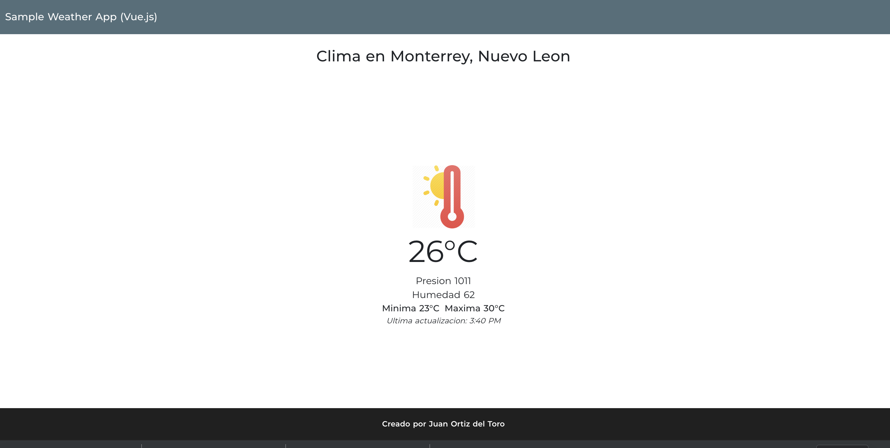

# weather-app

> sample weather app using Vue.js, just to learn the first steps of this framework. I've created the project with Nuxt.js.
for templates I am using Pug (Jade before) and Sass for styling all stuf!. 


## The sample looks like this


## Build Setup

```bash
# install dependencies
$ npm install

# serve with hot reload at localhost:3000
$ npm run dev

# build for production and launch server
$ npm run build
$ npm start

# generate static project
$ npm run generate
```
